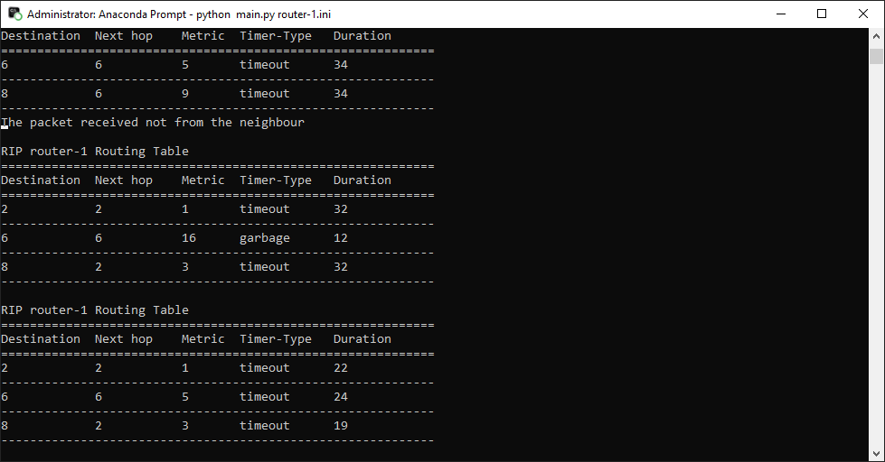

# COSC364-2021
Authors: El and JJ

To start run at least 2 routers

```shell
python main.py <router-n.ini>
```

To test run one router and a test script

```shell
python test.py
```

Output example

